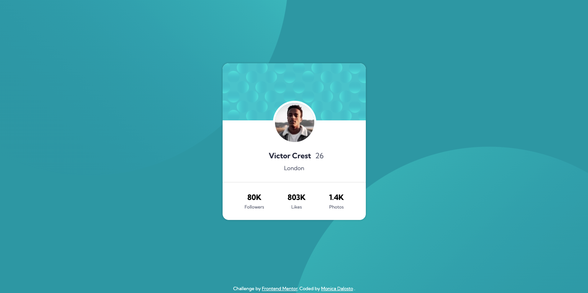
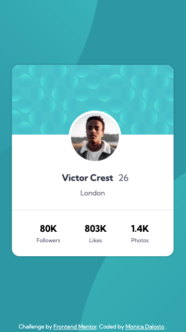

# Frontend Mentor - Profile card component solution

This is a solution to the Sixth challenge from Frontend Mentor. Frontend Mentor challenges is helping me  improve my coding skills by building realistic projects. 
The challenge: [Profile card component challenge on Frontend Mentor](https://www.frontendmentor.io/challenges/profile-card-component-cfArpWshJ). 

## Table of contents

- [Overview](#overview)
  - [The challenge](#the-challenge)
  - [Screenshot](#screenshot)
  - [Links](#links)
- [My process](#my-process)
  - [Built with](#built-with)
  - [What I learned](#what-i-learned)
  - [Continued development](#continued-development)
- [Author](#author)

## Overview

### The challenge

Users should be able to:

- Build out the project to the designs provided
- The circle images on the background

### Screenshot
- Desktop Screen:  

- Mobile Screen  

### Links

- Solution URL: [Profile card component challenge](https://github.com/MonicaDalosto/frontend-mentor-challenge06-profile-card-component)

- Live Site URL: [Challeng Webpage](https://monicadalosto.github.io/frontend-mentor-challenge06-profile-card-component/)

## My process

- I started on the Html file, adding the semantic elements and the divs;
- In this project I didn't use the variables, because It doesn't work on some browsers.
- I tried to style the elements on CSS using classes instead of the html elements, so I chose the properly class names;
- The project is mobile first (screen: 375px);
- I had used Flexbox to position the elements on the screen;
- Then I styled the elements from the top to the bottom;
- Add the responsiveness to the desktop screens (1440px);

### Built with

- Semantic HTML5 markup
- CSS custom properties
- Flexbox
- Mobile First

### What I learned

- I've practiced how to code using the mobile first concept
- How to use the background-position to position the images on the background

### Continued development

- Practice more the flexbox tools
- Practice and learn the mobile first concepts
- Learn how to code Utility Firts CSS;

## Author

- Frontend Mentor - [@MonicaDalosto](https://www.frontendmentor.io/profile/MonicaDalosto)
- Github - [@MonicaDalosto](https://github.com/MonicaDalosto)